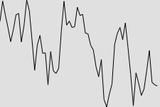
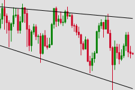

# fs-plot

`fsplot` is a Python library for lightweight visualization of financial market data using SVG. It provides functions to generate SVG charts, making it ideal for web and mobile applications that require efficient and compact chart rendering.

## Installation

To install `fsplot`, you can use pip. Run the following command:

```bash
pip install fsplot
```

## Use Case
`fsplot` is good for scenarios where you need SVG or lightweight chart visualization for financial market data in web or mobile applications. Its efficient rendering ensures that your charts are fast and responsive, making it suitable for real-time and static data presentations.


## Example Use

Here are some examples of how to use fsplot:

### Fetching Example Data

```python
import pandas as pd
import yfinance as yf

# Set the start and end dates
start_date = "2024-01-01"
end_date = "2024-09-01"

# Fetch Bitcoin data from Yahoo Finance
bitcoin = yf.download('BTC-USD', start=start_date, end=end_date)

# Ensure that the index is a DatetimeIndex
bitcoin.index = pd.to_datetime(bitcoin.index)

# Resample the data to a 2-day frequency and aggregate OHLC values
bitcoin = bitcoin.resample('3D').agg({
    'Open': 'first',
    'High': 'max',
    'Low': 'min',
    'Close': 'last'
})[-60:]
```

### Plotting a Line Chart

```python
from fsplot import plot_line

# Prepare data for plotting
data = bitcoin["Close"][-60:]

# Generate and display the candlestick plot
svg = plot_line(data)

with open("line.svg", "w") as file:
    file.write(svg)
```

Output:




### Plotting a Candlestick Chart

```python
from fsplot import plot_candlestick

# Prepare data for plotting
data = {
    "Open": bitcoin["Open"],
    "High": bitcoin["High"],
    "Low": bitcoin["Low"],
    "Close": bitcoin["Close"]
}

# Generate and display the candlestick plot
svg = plot_candlestick(data)

with open("candlestick.svg", "w") as file:
    file.write(svg)
```

Output:


### Plotting a Candlestick Chart with Trendline

```python
from trendline import calculate_trendline
from fsplot import plot_candlestick_trendline

# Calculate trendline
trend_line = calculate_trendline(bitcoin)


# Prepare data for plotting
data = {
    "Open": bitcoin["Open"],
    "High": bitcoin["High"],
    "Low": bitcoin["Low"],
    "Close": bitcoin["Close"],
    "support_first_value": trend_line["support_first_value"],
    "support_gradient": trend_line["support_gradient"],
    "resistance_first_value": trend_line["resistance_first_value"],
    "resistance_gradient": trend_line["resistance_gradient"]
}

# Generate and display the candlestick plot
svg = plot_candlestick_trendline(data)

with open("candlestick_trendline.svg", "w") as file:
    file.write(svg)
```

Output:



